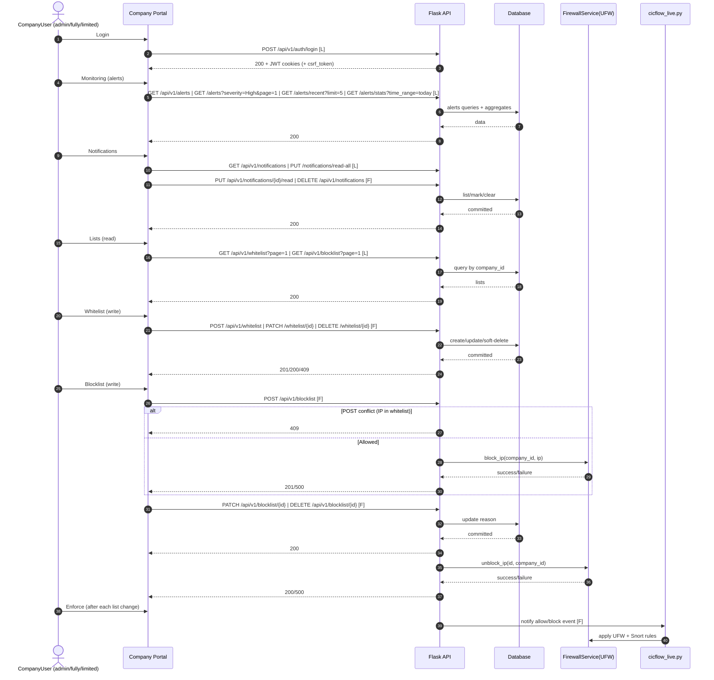
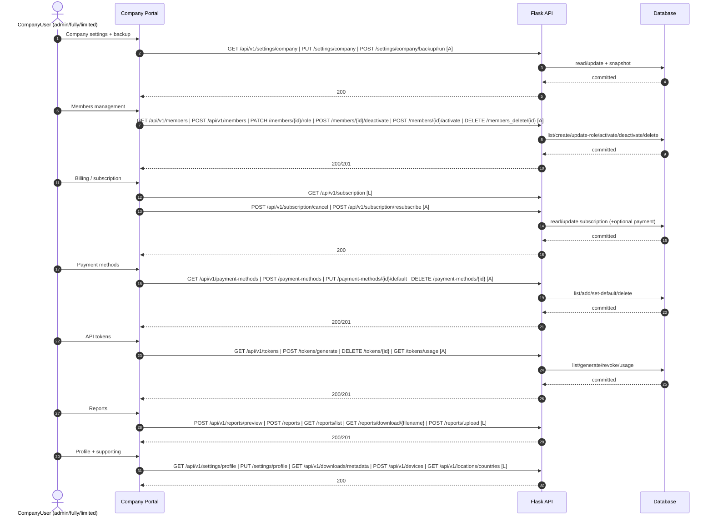

# Company Users — Sequence Diagrams (Split for Word)

## Page 1 — Auth, Monitoring, Notifications, Lists, Enforcement

```mermaid
sequenceDiagram
    autonumber
    actor U as CompanyUser (admin/fully/limited)
    participant UI as Company Portal
    participant API as Flask API
    participant DB as Database
    participant FW as FirewallService(UFW)
    participant ENF as cicflow_live.py

    U->>UI: Login
    UI->>API: POST /api/v1/auth/login  [L]
    API-->>UI: 200 + JWT cookies (+ csrf_token)

    U->>UI: Monitoring (alerts)
    UI->>API: GET /api/v1/alerts | GET /alerts?severity=High&page=1 | GET /alerts/recent?limit=5 | GET /alerts/stats?time_range=today  [L]
    API->>DB: alerts queries + aggregates
    DB-->>API: data
    API-->>UI: 200

    U->>UI: Notifications
    UI->>API: GET /api/v1/notifications | PUT /notifications/read-all  [L]
    UI->>API: PUT /api/v1/notifications/{id}/read | DELETE /api/v1/notifications  [F]
    API->>DB: list/mark/clear
    DB-->>API: committed
    API-->>UI: 200

    U->>UI: Lists (read)
    UI->>API: GET /api/v1/whitelist?page=1 | GET /api/v1/blocklist?page=1  [L]
    API->>DB: query by company_id
    DB-->>API: lists
    API-->>UI: 200

    U->>UI: Whitelist (write)
    UI->>API: POST /api/v1/whitelist | PATCH /whitelist/{id} | DELETE /whitelist/{id}  [F]
    API->>DB: create/update/soft-delete
    DB-->>API: committed
    API-->>UI: 201/200/409

    U->>UI: Blocklist (write)
    UI->>API: POST /api/v1/blocklist  [F]
    alt POST conflict (IP in whitelist)
        API-->>UI: 409
    else Allowed
        API->>FW: block_ip(company_id, ip)
        FW-->>API: success/failure
        API-->>UI: 201/500
    end
    UI->>API: PATCH /api/v1/blocklist/{id} | DELETE /api/v1/blocklist/{id}  [F]
    API->>DB: update reason
    DB-->>API: committed
    API-->>UI: 200
    API->>FW: unblock_ip(id, company_id)
    FW-->>API: success/failure
    API-->>UI: 200/500

    U->>UI: Enforce (after each list change)
    API->>ENF: notify allow/block event  [F]
    ENF->>FW: apply UFW + Snort rules
```

## Page 2 — Admin Ops, Billing, Tokens, Reports, Profile

```mermaid
sequenceDiagram
    autonumber
    actor U as CompanyUser (admin/fully/limited)
    participant UI as Company Portal
    participant API as Flask API
    participant DB as Database

    U->>UI: Company settings + backup
    UI->>API: GET /api/v1/settings/company | PUT /settings/company | POST /settings/company/backup/run  [A]
    API->>DB: read/update + snapshot
    DB-->>API: committed
    API-->>UI: 200

    U->>UI: Members management
    UI->>API: GET /api/v1/members | POST /api/v1/members | PATCH /members/{id}/role | POST /members/{id}/deactivate | POST /members/{id}/activate | DELETE /members_delete/{id}  [A]
    API->>DB: list/create/update-role/activate/deactivate/delete
    DB-->>API: committed
    API-->>UI: 200/201

    U->>UI: Billing / subscription
    UI->>API: GET /api/v1/subscription  [L]
    UI->>API: POST /api/v1/subscription/cancel | POST /api/v1/subscription/resubscribe  [A]
    API->>DB: read/update subscription (+optional payment)
    DB-->>API: committed
    API-->>UI: 200

    U->>UI: Payment methods
    UI->>API: GET /api/v1/payment-methods | POST /payment-methods | PUT /payment-methods/{id}/default | DELETE /payment-methods/{id}  [A]
    API->>DB: list/add/set-default/delete
    DB-->>API: committed
    API-->>UI: 200/201

    U->>UI: API tokens
    UI->>API: GET /api/v1/tokens | POST /tokens/generate | DELETE /tokens/{id} | GET /tokens/usage  [A]
    API->>DB: list/generate/revoke/usage
    DB-->>API: committed
    API-->>UI: 200/201

    U->>UI: Reports
    UI->>API: POST /api/v1/reports/preview | POST /reports | GET /reports/list | GET /reports/download/{filename} | POST /reports/upload  [L]
    API-->>UI: 200/201

    U->>UI: Profile + supporting
    UI->>API: GET /api/v1/settings/profile | PUT /settings/profile | GET /api/v1/downloads/metadata | POST /api/v1/devices | GET /api/v1/locations/countries  [L]
    API-->>UI: 200
```
