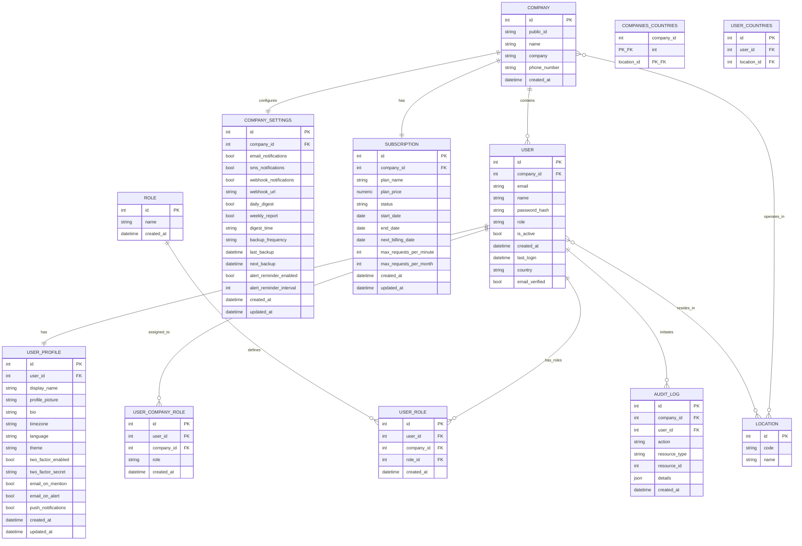
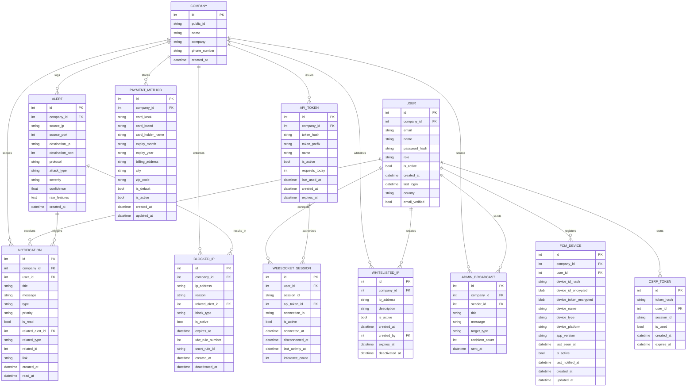

# Database ERD (Split for Word)

## Page 1 — Tenancy, Users, RBAC, Settings, Locations, Audit

```mermaid
erDiagram
  COMPANY ||--o{ USER : contains
  COMPANY ||--|| COMPANY_SETTINGS : configures
  COMPANY ||--|| SUBSCRIPTION : has
  COMPANY }o--o{ LOCATION : operates_in

  USER ||--|| USER_PROFILE : has
  USER ||--o{ USER_ROLE : has_roles
  USER ||--o{ USER_COMPANY_ROLE : assigned_to
  USER ||--o{ AUDIT_LOG : initiates
  USER }o--o{ LOCATION : resides_in

  ROLE ||--o{ USER_ROLE : defines

  COMPANY {
    int id PK
    string public_id
    string name
    string company
    string phone_number
    datetime created_at
  }

  USER {
    int id PK
    int company_id FK
    string email
    string name
    string password_hash
    string role
    bool is_active
    datetime created_at
    datetime last_login
    string country
    bool email_verified
  }

  ROLE {
    int id PK
    string name
    datetime created_at
  }

  USER_ROLE {
    int id PK
    int user_id FK
    int company_id FK
    int role_id FK
    datetime created_at
  }

  USER_COMPANY_ROLE {
    int id PK
    int user_id FK
    int company_id FK
    string role
    datetime created_at
  }

  USER_PROFILE {
    int id PK
    int user_id FK
    string display_name
    string profile_picture
    string bio
    string timezone
    string language
    string theme
    bool two_factor_enabled
    string two_factor_secret
    bool email_on_mention
    bool email_on_alert
    bool push_notifications
    datetime created_at
    datetime updated_at
  }

  COMPANY_SETTINGS {
    int id PK
    int company_id FK
    bool email_notifications
    bool sms_notifications
    bool webhook_notifications
    string webhook_url
    bool daily_digest
    bool weekly_report
    string digest_time
    string backup_frequency
    datetime last_backup
    datetime next_backup
    bool alert_reminder_enabled
    int alert_reminder_interval
    datetime created_at
    datetime updated_at
  }

  SUBSCRIPTION {
    int id PK
    int company_id FK
    string plan_name
    numeric plan_price
    string status
    date start_date
    date end_date
    date next_billing_date
    int max_requests_per_minute
    int max_requests_per_month
    datetime created_at
    datetime updated_at
  }

  LOCATION {
    int id PK
    string code
    string name
  }

  AUDIT_LOG {
    int id PK
    int company_id FK
    int user_id FK
    string action
    string resource_type
    int resource_id
    json details
    datetime created_at
  }

  COMPANIES_COUNTRIES {
    int company_id PK_FK
    int location_id PK_FK
  }

  USER_COUNTRIES {
    int id PK
    int user_id FK
    int location_id FK
  }
```

## Page 2 — Alerts, Notifications, Security Controls, Devices, Sessions, Admin Messaging

```mermaid
erDiagram
  COMPANY ||--o{ ALERT : logs
  COMPANY ||--o{ NOTIFICATION : scopes
  COMPANY ||--o{ API_TOKEN : issues
  COMPANY ||--o{ PAYMENT_METHOD : stores
  COMPANY ||--o{ BLOCKED_IP : enforces
  COMPANY ||--o{ WHITELISTED_IP : whitelists
  COMPANY ||--o{ ADMIN_BROADCAST : source

  USER ||--o{ NOTIFICATION : receives
  USER ||--o{ FCM_DEVICE : registers
  USER ||--o{ CSRF_TOKEN : owns
  USER ||--o{ WEBSOCKET_SESSION : connects
  USER ||--o{ ADMIN_BROADCAST : sends
  USER ||--o{ WHITELISTED_IP : creates

  ALERT ||--o{ NOTIFICATION : triggers
  ALERT ||--o{ BLOCKED_IP : results_in

  API_TOKEN ||--o{ WEBSOCKET_SESSION : authorizes

  COMPANY {
    int id PK
    string public_id
    string name
    string company
    string phone_number
    datetime created_at
  }

  USER {
    int id PK
    int company_id FK
    string email
    string name
    string password_hash
    string role
    bool is_active
    datetime created_at
    datetime last_login
    string country
    bool email_verified
  }

  ALERT {
    int id PK
    int company_id FK
    string source_ip
    int source_port
    string destination_ip
    int destination_port
    string protocol
    string attack_type
    string severity
    float confidence
    text raw_features
    datetime created_at
  }

  NOTIFICATION {
    int id PK
    int company_id FK
    int user_id FK
    string title
    string message
    string type
    string priority
    bool is_read
    int related_alert_id FK
    string related_type
    int related_id
    string link
    datetime created_at
    datetime read_at
  }

  API_TOKEN {
    int id PK
    int company_id FK
    string token_hash
    string token_prefix
    string name
    bool is_active
    int requests_today
    datetime last_used_at
    datetime created_at
    datetime expires_at
  }

  WEBSOCKET_SESSION {
    int id PK
    int user_id FK
    string session_id
    int api_token_id FK
    string connection_ip
    bool is_active
    datetime connected_at
    datetime disconnected_at
    datetime last_activity_at
    int inference_count
  }

  CSRF_TOKEN {
    int id PK
    string token_hash
    int user_id FK
    string session_id
    bool is_used
    datetime created_at
    datetime expires_at
  }

  FCM_DEVICE {
    int id PK
    int company_id FK
    int user_id FK
    string device_id_hash
    blob device_id_encrypted
    blob device_token_encrypted
    string device_name
    string device_type
    string device_platform
    string app_version
    datetime last_seen_at
    bool is_active
    datetime last_notified_at
    datetime created_at
    datetime updated_at
  }

  BLOCKED_IP {
    int id PK
    int company_id FK
    string ip_address
    string reason
    int related_alert_id FK
    string block_type
    bool is_active
    datetime expires_at
    int ufw_rule_number
    string snort_rule_id
    datetime created_at
    datetime deactivated_at
  }

  WHITELISTED_IP {
    int id PK
    int company_id FK
    string ip_address
    string description
    bool is_active
    datetime created_at
    int created_by FK
    datetime expires_at
    datetime deactivated_at
  }

  ADMIN_BROADCAST {
    int id PK
    int company_id FK
    int sender_id FK
    string title
    string message
    string target_type
    int recipient_count
    datetime sent_at
  }

  PAYMENT_METHOD {
    int id PK
    int company_id FK
    string card_last4
    string card_brand
    string card_holder_name
    string expiry_month
    string expiry_year
    string billing_address
    string city
    string zip_code
    bool is_default
    bool is_active
    datetime created_at
    datetime updated_at
  }
```
